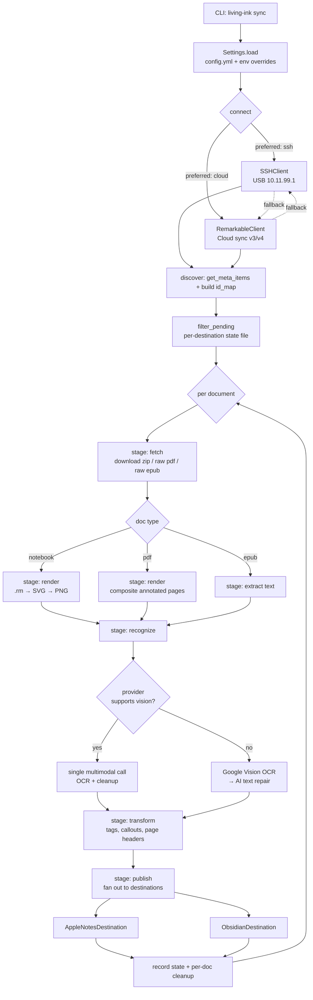

# Living Ink — DRY / KISS / YAGNI Refactor & Modularity Plan

## Objective

Turn Living Ink from a working-but-accreted script collection into a production-grade,
extensible sync pipeline: **reMarkable tablet → (OCR + AI cleanup) → Apple Notes / Obsidian**.

Two audiences must both be served after this work:

- **Non-technical users** — the front end stays a single, boring CLI (`living-ink setup`,
  `living-ink sync`, `living-ink status`). Nothing in this plan adds a flag, a config key,
  or a decision that an end user has to make.
- **Contributors** — the back end becomes modular enough that "add a Notion destination",
  "add an Anthropic provider", or "add a Wi-Fi transport" is a new file plus a registry
  entry, not a patch threaded through `pipeline.py`.

### Current shortcomings

| # | Shortcoming | Evidence |
|---|---|---|
| 1 | **~1,050 lines of dead code** ship in the wheel and in every reviewer's head | `extract.py:44-196` (cache layer, `find_similar_documents`), `extract.py:870-900` + `953-1493` (entire alternate OCR subsystem, reachable only from itself), `pipeline.py:378`, `:408`, `:495`, `api.py` ×4, `ssh.py:404`, `ssh.py` `check_ssh_available` |
| 2 | **4 runtime dependencies exist only to serve dead code** | `cairosvg` and `pytesseract` are referenced *only* inside `extract.py:953-1493`; `pypdf` is declared and never imported; `google-cloud-vision` is declared twice (base **and** `[ocr]` extra) |
| 3 | **The same logic is written 2–3 times** | 3 repo-root finders; the 10-parameter sync signature appears 3× in `pipeline.py`; 2 complete argparse definitions for `sync`; `StatusCommand._run_console` / `_run_json` duplicate all probing; `_chat` / `ocr_image` duplicate the whole HTTP stack; 2 `Document` dataclasses; 2 filename sanitizers; 3 copies of the zip-extract block |
| 4 | **`pipeline.py` does work at import time** | `pipeline.py:75-95` resolves paths and calls `mkdir` ×6; `:255-263` and `:332-338` load YAML and instantiate destinations as module-level globals. Importing the module mutates the filesystem and `os.environ`. |
| 5 | **No transport contract** | `FallbackClient` and callers use `hasattr(client, "get_file_type")` / `hasattr(client, "download_raw_file")` in 5 places (`api.py:84`, `:90`, `:281`, `:301`, `pipeline.py:801`, `:1344`, `:1379`) because `ssh.SSHClient` and `sync.RemarkableClient` have silently different surfaces |
| 6 | **`process_notebook_item` is ~380 lines** | `pipeline.py:1244-1625` — download, render, tags, preprocess, OCR, file writes, publish loop and cleanup in one function. This is the single biggest blocker to adding a feature. |
| 7 | **Circular dependency** | `pipeline → setup_wizard` (`pipeline.py:702`) and `setup_wizard → pipeline` (`setup_wizard.py:1035`), survivable only because both imports are lazy |
| 8 | **85 `except Exception` handlers** | Highest density in `extract.py` (27), `pipeline.py` (15), `setup_wizard.py` (13), `ssh.py` (11). Both `Destination.publish` implementations wrap their entire body and return `False`, so a bug and an offline tablet are indistinguishable. |
| 9 | **Config is written by f-string interpolation** | `setup_wizard.py:549-586` builds YAML with `"{ai_api_key}"`. A key, path, or folder name containing `"` or `\` silently produces a corrupt config file. |
| 10 | **Docs describe a codebase that no longer exists** | `AGENTS.md` and `.github/copilot-instructions.md` reference a `scripts/` directory and `config/config.yml.example`, both deleted in `8be0bc1`; `AGENTS.md` claims "Known Issues & Tech Debt: None currently tracking" |

### Non-goals

- No change to the CLI surface, config schema, or on-disk state format. A user upgrading
  mid-plan keeps their `~/.config/living-ink/config.yml` and their
  `processed_notebooks_*.json` files untouched.
- No new destination, provider, or transport is *added* here. This plan makes adding them cheap.
- No rewrite of the `.rm → SVG → PNG` rendering path. It works; it is only de-duplicated.

---

## Execution order

Ordered **correctness & safety → foundations → architecture → docs**. Deletion comes before
de-duplication on purpose: there is no reason to carefully DRY up code that Phase 1 removes.

| # | Task | Phase | Priority | Depends on | Net lines |
|---|---|---|---|---|---|
| 1 | Fix the never-populated SSH file-type cache | 0 — Correctness | P0 | — | ~+5 |
| 2 | Serialize config with a YAML emitter, not f-strings | 0 — Correctness | P0 | — | ~−20 |
| 3 | Stop `Destination.publish` from swallowing every exception | 0 — Correctness | P1 | — | ~+15 |
| 4 | Delete the dead alternate OCR subsystem | 1 — Foundations | P0 | — | ~−700 |
| 5 | Delete the dead extraction cache + `find_similar_documents` | 1 — Foundations | P0 | — | ~−170 |
| 6 | Delete dead functions in `pipeline` / `api` / `ssh` | 1 — Foundations | P0 | 1 | ~−180 |
| 7 | Prune dependencies; drop `libcairo2` from Docker + CI | 1 — Foundations | P0 | 4, 5, 6 | ~−10 |
| 8 | One path-resolution module | 2 — DRY | P1 | 6 | ~−45 |
| 9 | `SyncOptions` dataclass replaces the triplicated signature | 2 — DRY | P1 | 8 | ~−90 |
| 10 | Delete `pipeline.main()` and its duplicate argparse | 2 — DRY | P1 | 9 | ~−60 |
| 11 | Collapse `StatusCommand` console/JSON into one probe | 2 — DRY | P1 | 8 | ~−120 |
| 12 | One HTTP transport in `providers.py` | 2 — DRY | P1 | — | ~−90 |
| 13 | One zip-extract helper in `extract.py` | 2 — DRY | P2 | 4 | ~−50 |
| 14 | One `Document` model, one filename sanitizer | 2 — DRY | P2 | 8 | ~−70 |
| 15 | Remove import-time side effects from `pipeline.py` | 3 — Architecture | P0 | 8, 9 | ~−30 |
| 16 | `RemarkableTransport` Protocol; delete `hasattr` duck-typing | 3 — Architecture | P1 | 14, 15 | ~+40 |
| 17 | Decompose `process_notebook_item` into named stages | 3 — Architecture | P1 | 15, 16 | ~+30 |
| 18 | Break the `pipeline ↔ setup_wizard` cycle | 3 — Architecture | P1 | 15 | ~−10 |
| 19 | Typed `Settings` object; stop round-tripping through `os.environ` | 3 — Architecture | P2 | 15 | ~−60 |
| 20 | Destination & provider registries | 3 — Architecture | P2 | 15, 19 | ~−20 |
| 21 | Rewrite `AGENTS.md` and `copilot-instructions.md` | 4 — Docs | P1 | 1–20 | — |
| 22 | Commit the architecture doc and dependency graph | 4 — Docs | P2 | 21 | — |

Rough total: **~−1,600 lines** with test coverage held or improved.

Each numbered task is one atomic commit. The suite (`uv run pytest tests/ -v`) plus
`uv run ruff check . && uv run ruff format --check .` must pass at every task boundary.

---

## Target flow

The pipeline today is one long function. The target is a named stage sequence, which is
what makes Task 17 worth doing:



Each `stage:` box becomes one method with a typed input and a typed output. A new document
type touches only `render`; a new AI backend touches only `recognize`; a new sync target
touches only `publish`.

---

# Phase 0 — Correctness & safety

## Task 1 — Fix the never-populated SSH file-type cache

- **File(s):** `src/living_ink/ssh.py:361-402`
- **Priority:** P0
- **Depends on:** —

### The problem

`SSHClient.get_file_type()` (`ssh.py:361`) reads `self._file_type_cache` on entry but never
writes to it. The only writer, `get_all_file_types()` (`ssh.py:404`), is never called from
anywhere in `src/` or `tests/`. The cache is therefore permanently empty, and
`pipeline.get_document_type()` (`pipeline.py:791`) calls `get_file_type()` once per document
during discovery — one SSH round-trip per notebook, serially, over USB.

### The solution

```
# ssh.py — inside SSHClient.get_file_type
def get_file_type(doc):
    if doc.ID in self._file_type_cache:
        return self._file_type_cache[doc.ID]

    file_type = <existing single-document probe, unchanged>

    self._file_type_cache[doc.ID] = file_type   # <-- the missing line
    return file_type
```

Then decide `get_all_file_types()`'s fate. It batches the probe into one `ssh ... ls` call,
which is strictly better for the discovery loop. Two options, in order of preference:

1. Call it once from `discover_documents()` to warm the cache, then let `get_file_type()`
   serve every subsequent lookup from memory. One round-trip total.
2. If wiring it in proves fiddly, delete it under Task 6 and keep only the per-document
   memoization above.

Take option 1. Add a test that asserts a second `get_file_type()` for the same document
issues no additional `subprocess.run`.

### Why this matters

This is the only *behavioural* defect found in the audit, and it is on the hot path of every
sync. Fixing it before Task 6 prevents the deletion pass from quietly removing the batch
method that is the actual fix.

---

## Task 2 — Serialize config with a YAML emitter, not f-strings

- **File(s):** `src/living_ink/setup_wizard.py:507-586`
- **Priority:** P0
- **Depends on:** —

### The problem

`generate_config_yaml()` builds the config file by interpolating user-supplied strings into
a quoted-YAML f-string:

```
  api_key: "{ai_api_key}"
  vault_path: "{clean_vault}"
  folder_name: "{apple_notes_folder}"
```

Any value containing `"` or a trailing `\` produces a file that `yaml.safe_load` either
rejects or, worse, parses into something different from what the user typed. Vault paths and
Apple Notes folder names are free-text and drag-and-dropped from Finder. `pyyaml` is already
a declared dependency, so this is hand-rolling a solved problem.

### The solution

Build a plain `dict` and emit it, keeping the explanatory comments as a separate header
string so the generated file stays as readable as it is today:

```
# setup_wizard.py
_CONFIG_HEADER = """# Living Ink Configuration
# Generated by the setup wizard. Safe to edit by hand.
...
"""

def generate_config_yaml(...) -> str:
    settings = {
        "ai": {"provider": ..., "api_key": ..., "model": ...},
        "remarkable": {...},
        "google_vision": {"credentials_path": ""},
        "sync": {"max_notebooks_per_run": ...},
        "obsidian": {...},
        "apple_notes": {...},
    }
    body = yaml.safe_dump(settings, sort_keys=False, allow_unicode=True,
                          default_flow_style=False)
    return _CONFIG_HEADER + body
```

Existing `tests/test_setup_wizard.py` assertions that match raw substrings will need to be
re-pointed at `yaml.safe_load(result)` instead — which is the assertion they should always
have made.

### Why this matters

The setup wizard is the only thing a non-technical user ever interacts with. A config it
writes must always be a config the pipeline can read back. Round-tripping through the YAML
library makes that structurally true rather than true by luck.

---

## Task 3 — Stop `Destination.publish` from swallowing every exception

- **File(s):** `src/living_ink/destinations.py:179-320`, `:401-576`; `src/living_ink/pipeline.py` (publish loop)
- **Priority:** P1
- **Depends on:** —

### The problem

Both `AppleNotesDestination.publish` and `ObsidianDestination.publish` wrap their entire body
in `try: ... except Exception: return False`. The caller gets a bare `False` and cannot tell
apart: tablet offline, AppleScript rejected by macOS privacy settings, vault path deleted,
disk full, or a genuine `AttributeError` in our own code. The last one — a real bug — is
indistinguishable from the first four and is silently retried on the next run, forever.

### The solution

Introduce a small exception hierarchy in `destinations.py` and let programming errors
propagate:

```
class DestinationError(Exception):
    """Publishing failed for an expected, user-actionable reason."""

class DestinationUnavailable(DestinationError):
    """The destination is not reachable right now; retry later is sensible."""

# in publish():
#   catch only the narrow, expected failures and re-raise as DestinationError
#   with a message naming the user-visible cause:
#     subprocess.CalledProcessError / TimeoutExpired  -> DestinationUnavailable
#     OSError (vault write)                           -> DestinationError
#   let everything else propagate
```

`publish()` keeps its `-> bool` return for the success path. The pipeline publish loop catches
`DestinationError`, logs the message, marks the document unpublished for *that* destination
only, and continues to the next one — the current fan-out behaviour, preserved.

Apply the same narrowing opportunistically to the highest-value handlers elsewhere
(`pipeline.py`, `ssh.py`) as those functions are touched in later tasks. Do **not** attempt
all 85 in one commit.

### Why this matters

Open-source users file bug reports from log output. Today every failure mode prints the same
thing. This is also the precondition for any future retry/backoff feature: retry is only safe
once "transient" and "broken" are distinguishable.

---

# Phase 1 — Foundations: delete what is not used

## Task 4 — Delete the dead alternate OCR subsystem

- **File(s):** `src/living_ink/extract.py:870-900`, `:953-1493`
- **Priority:** P0
- **Depends on:** —

### The problem

`extract.py` contains a complete second OCR implementation that nothing calls. Reachability
analysis over `src/` and `tests/`:

```
extract_text_from_document_zip   (extract.py:953)   0 external callers
  ├── extract_text_from_rm_file  (extract.py:445)   called only from :1039
  └── extract_handwriting_ocr    (extract.py:1100)  called only from :1085
        ├── _ocr_google_vision       (:1142)  called only from :1135
        │     ├── _ocr_google_vision_rest (:1163)  only from :1157
        │     └── _ocr_google_vision_sdk  (:1275)  only from :1160
        └── _ocr_tesseract           (:1382)  only from :1138, :1254, :1376, :1379
render_page_from_document_zip_svg (extract.py:870)  0 callers
```

The entire subtree is referenced only from inside itself. The live OCR path is completely
separate: `clean.ocr_and_repair()` → `providers.UniversalChatProvider.ocr_image()` for vision
models, or `pipeline.google_vision_available()` / `vision_ocr_image_service_account()`
(`pipeline.py:450`, `:471`) for the two-step path.

### The solution

Delete lines 870–900 and 953–1493 and the now-unreferenced imports at the top of the file.
Verify with a reachability re-run before and after:

```
# scripted check, run before and after the deletion
for each top-level def in extract.py:
    grep the symbol across src/ and tests/, excluding its own definition line
    report any def with zero references
# expected after: zero dead defs in extract.py
```

Then `uv run pytest tests/ -v` — no test imports any deleted symbol (`tests/test_tags.py`
and `tests/test_pdf_epub_sync.py` are the only files importing from `extract`, and they
import `normalize_tag`, `extract_tags_from_*`, `format_page_*`, and `get_pdf_toc_breadcrumbs`,
all of which survive).

### Why this matters

This is ~570 lines — a third of the largest file in the project. Every contributor reading
`extract.py` currently has to work out which of the two OCR paths is real. YAGNI: if a
tesseract fallback is wanted later, it belongs behind the `TextRepairProvider` ABC as a
first-class provider, not as an orphaned branch inside the renderer module.

---

## Task 5 — Delete the dead extraction cache and `find_similar_documents`

- **File(s):** `src/living_ink/extract.py:44-198`
- **Priority:** P0
- **Depends on:** —

### The problem

A five-function TTL cache layer — `clear_extraction_cache` (`:65`), `get_cached_page_ocr`
(`:84`), `cache_page_ocr` (`:110`), `get_cached_ocr_result` (`:132`), `cache_ocr_result`
(`:161`) — plus `_is_cache_valid` (`:58`) and `CACHE_TTL_SECONDS` (`:45`) has zero callers.
It was built for the OCR subsystem deleted in Task 4. `find_similar_documents` (`:182`) also
has zero callers and no obvious relationship to the sync pipeline at all.

### The solution

Delete `extract.py:44-198` wholesale, keeping `get_background_color()` (`:32`) which is live.

Caching is a legitimate future want — re-OCR'ing an unchanged page is wasted spend. But an
in-process TTL dict is the wrong shape for a CLI that exits after each run, and it cached the
wrong layer. If caching returns, it belongs next to the per-destination state files as a
content-hash-keyed store on disk. Note this in the architecture doc (Task 22) so the intent
is not lost with the code.

### Why this matters

YAGNI, precisely: speculative infrastructure for a feature that was never wired up, now
outliving the subsystem it was written for.

---

## Task 6 — Delete dead functions in `pipeline`, `api`, `ssh`

- **File(s):** `src/living_ink/pipeline.py:86`, `:255-263`, `:378`, `:408`, `:495`; `src/living_ink/api.py`; `src/living_ink/ssh.py`
- **Priority:** P0
- **Depends on:** Task 1

### The problem

Zero-caller symbols confirmed by the same reachability sweep:

| File | Symbol | Note |
|---|---|---|
| `pipeline.py:378` | `find_notebook_images` | |
| `pipeline.py:408` | `vision_ocr_image` | superseded by `vision_ocr_image_service_account` (`:471`), which *is* live |
| `pipeline.py:495` | `make_pdf_from_images` | the only `reportlab` consumer — check before pruning that dep |
| `pipeline.py:86` | `PROCESSED_LOG` | superseded by per-destination `get_state_file_path()` (`:341`) |
| `pipeline.py:255-263` | first `importlib.util.spec_from_file_location` block | builds a spec and discards it; the second block at `:332-338` is the one that runs |
| `api.py` | `ensure_config_dir`, `get_items_by_id`, `get_items_by_parent`, `get_item_path` | |
| `ssh.py` | `check_ssh_available` | `SSHClient.check_connection()` is the live equivalent |
| `ssh.py` | `is_cloud_archived`, `Folder` alias | |
| `sync.py:79` | `Folder = Document` alias | |

### The solution

Delete each, one commit for the whole sweep since they are a single logical change
("remove dead code"). Two guards:

- Before deleting `make_pdf_from_images`, confirm `reportlab` has no other importer. If it
  does not, `reportlab` joins the Task 7 prune list.
- The `pipeline.py:255-263` legacy `config.py` loading is vestigial support for a pre-YAML
  config format. Confirm no `config.py` shim is documented in `README.md` before removing
  both blocks; if the legacy path is still advertised, keep the *second* block only and
  delete the discarded-spec first block.

### Why this matters

Dead code in a published wheel is dead code every downstream user installs, every scanner
flags, and every new contributor reads before learning it does nothing.

---

## Task 7 — Prune dependencies; drop `libcairo2` from Docker and CI

- **File(s):** `pyproject.toml:24-49`, `Dockerfile:10-15`, `.github/workflows/publish.yml:47-49`
- **Priority:** P0
- **Depends on:** Tasks 4, 5, 6

### The problem

| Dependency | Status after Phase 1 |
|---|---|
| `cairosvg>=2.8.2` | referenced **only** at `extract.py:1197`, `:1203`, `:1310`, `:1317`, `:1420`, `:1427` — all inside the block deleted by Task 4. The live renderer `render_rm_file_to_png` (`extract.py:582`) uses **PyMuPDF**, despite its docstring at `:588` claiming cairosvg. |
| `pytesseract>=0.3.10` | referenced only at `extract.py:1393`, `:1468` — deleted by Task 4 |
| `pypdf>=6.6.0` | declared, never imported anywhere |
| `google-cloud-vision>=3.11.0` | declared in **both** `dependencies` and `[project.optional-dependencies] ocr` — the extra is meaningless because the base install always pulls it |
| `black>=23.0.0` | in `dev` extras, but Ruff is the configured formatter (`[tool.ruff]`) and CI runs `ruff format --check` |
| `reportlab>=4.4.7` | pending the Task 6 check on `make_pdf_from_images` |

Because `cairosvg` goes, the `libcairo2` system package installed in `Dockerfile:10-15` and
in the CI step I added at `.github/workflows/publish.yml:47-49` is no longer needed by
anything.

### The solution

```
# pyproject.toml
dependencies = [
    "rmscene", "Pillow", "rmc", "requests", "pymupdf",
    "ebooklib", "beautifulsoup4", "pyyaml",
    # google-cloud-vision moves OUT of base and stays only in [ocr]
]
[project.optional-dependencies]
ocr = ["google-cloud-vision>=3.0.0"]
dev = ["pytest", "pytest-asyncio", "ruff"]          # black removed

# Dockerfile: drop libcairo2 from the apt install (keep ca-certificates, curl)
# publish.yml: delete the "Install system dependencies" step entirely
```

Moving `google-cloud-vision` out of base makes the two-step OCR path an opt-in extra
(`uv sync --extra ocr`), matching how it is already documented. Guard the import sites —
`pipeline.google_vision_available()` (`:450`) already probes for availability, so confirm it
degrades cleanly and that CI's `uv sync --all-extras` still installs it for tests.

Also fix the stale docstring at `extract.py:588` to say PyMuPDF.

### Why this matters

`cairosvg` requires a system C library. Dropping it removes the single biggest install
failure mode for non-technical users on macOS and the reason the Docker image needs an apt
layer at all. Fewer runtime deps is also a smaller supply-chain surface for an open-source
project.

---

# Phase 2 — Foundations: say each thing once

## Task 8 — One path-resolution module

- **File(s):** `src/living_ink/config.py:13-129`, `src/living_ink/cli.py:21-70`, `src/living_ink/pipeline.py:64-95`
- **Priority:** P1
- **Depends on:** Task 6

### The problem

Three independent implementations of "where is the repo root, and where do config/data/logs
live":

- `config._find_repo_root()` (`config.py:13`) + `get_config_path` / `get_config_dir` /
  `get_data_dir` / `get_logs_dir` — the canonical one, with a documented 8-step resolution order
- `cli.get_root()` (`cli.py:21`) + `cli.get_config_path()` (`cli.py:40`) — a second copy
- `pipeline._find_root()` (`pipeline.py:64`) — a third copy

They can disagree. `cli.get_config_path()` and `config.get_config_path()` have different
signatures (`root=` vs `repo_dir=`), so a caller who picks the wrong one gets the wrong file.

### The solution

`config.py` is the single source of truth. Delete `cli.get_root`, `cli.get_config_path`, and
`pipeline._find_root`; re-point every caller at `config`. Where `cli.py` needs a root for
display, expose it from `config` under one name:

```
# config.py — the only public path API
def find_repo_root() -> Optional[Path]      # renamed from _find_repo_root, now public
def get_config_path(repo_dir=None) -> Path
def get_config_dir(repo_dir=None) -> Path
def get_data_dir(repo_dir=None) -> Path
def get_logs_dir(repo_dir=None) -> Path
```

Keep `LIVING_INK_CONFIG`, `LIVING_INK_CONFIG_DIR`, `LIVING_INK_DATA_DIR` semantics exactly
as `config.py` implements them today — tests depend on the override order.

### Why this matters

Path resolution is the foundation everything else stands on. Task 15 cannot remove the
import-time `mkdir` calls in `pipeline.py` while `pipeline.py` still owns its own notion of
where things go.

---

## Task 9 — `SyncOptions` dataclass replaces the triplicated signature

- **File(s):** `src/living_ink/pipeline.py:943-1066`, `:1068-1117`, `:1627-1694`
- **Priority:** P1
- **Depends on:** Task 8

### The problem

The same ten parameters — `notebook, limit, folder, ssh, cloud, preferred_connection,
sync_pdfs, sync_epubs, all_types, keep_temp` — are written out in full three times:
`SyncPipeline.__init__` (`:943`), `SyncPipeline._apply_overrides` (`:1068`), and
`SyncPipeline.run` (`:1627`). Adding one option means editing three signatures, three
docstrings, and the two argparse definitions (Task 10). `_apply_overrides` exists only to
reconcile constructor values with `run()` values — a problem created entirely by having the
parameters in two places.

`cli.SyncCommand.run` then has to defend against the ambiguity with
`getattr(args, "sync_pdfs", False) if hasattr(args, "sync_pdfs") and args.sync_pdfs else None`.

### The solution

```
@dataclass(frozen=True)
class SyncOptions:
    notebook: str | None = None
    limit: int | None = None
    folder: str | None = None
    ssh: bool = False
    cloud: bool = False
    preferred_connection: str | None = None
    sync_pdfs: bool = False
    sync_epubs: bool = False
    all_types: bool = False
    keep_temp: bool = False

    @classmethod
    def from_args(cls, args: argparse.Namespace) -> "SyncOptions":
        # one place that knows how argparse defaults map to option values;
        # the getattr/hasattr triple-guard in cli.py collapses into this

    def merged_with(self, other: "SyncOptions") -> "SyncOptions":
        # replaces _apply_overrides: non-default fields of `other` win

class SyncPipeline:
    def __init__(self, options: SyncOptions | None = None, ...): ...
    def run(self, options: SyncOptions | None = None) -> int:
        opts = self.options.merged_with(options) if options else self.options
```

Delete `_apply_overrides`. Keep a thin keyword-compatible shim on `run()` only if
`tests/test_pipeline.py` or `tests/test_notebook_selection.py` call it positionally — check
first, and prefer updating the tests.

### Why this matters

"We are going to be adding more features and personalization" means this signature will grow.
Right now each new option costs five edits in three files. After this it costs one field.

---

## Task 10 — Delete `pipeline.main()` and its duplicate argparse

- **File(s):** `src/living_ink/pipeline.py:1697-1751`, `src/living_ink/cli.py:110-190`
- **Priority:** P1
- **Depends on:** Task 9

### The problem

`pipeline.main()` (`:1697`) defines a complete argparse parser for the sync flags. So does
`cli.SyncCommand.register_args()` (`cli.py:110`). Only the CLI one is reachable from the
`living-ink` entry point (`pyproject.toml` → `living_ink.cli:main`) or from
`python -m living_ink` (`__main__.py` → `cli`). `pipeline.main()` is a second, drifting
definition of the user interface, reachable only by `python -m living_ink.pipeline`.

### The solution

Delete `pipeline.main()` and the `if __name__ == "__main__"` guard. `cli.SyncCommand` becomes
the single definition of the sync CLI surface; it constructs a `SyncOptions` (Task 9) and
hands it to `SyncPipeline`.

If `python -m living_ink.pipeline` is documented anywhere as a supported invocation, grep
`README.md` / `AGENTS.md` and remove those references in Task 21.

### Why this matters

Two argparse definitions means two sets of `--help` text, two sets of defaults, and a
guaranteed drift the moment someone adds a flag to one. KISS: one front door.

---

## Task 11 — Collapse `StatusCommand` console/JSON into one probe

- **File(s):** `src/living_ink/cli.py:236-505`
- **Priority:** P1
- **Depends on:** Task 8

### The problem

`StatusCommand._run_console()` (`cli.py:249-395`) and `StatusCommand._run_json()`
(`cli.py:397-505`) each independently: load the config, verify SSH, verify cloud, verify the
AI provider, check the Obsidian vault, check Apple Notes, and check the LaunchAgent. ~250
lines where ~125 is the probing and the rest is two renderings of it. The two paths can — and
over time will — report different things for the same machine.

### The solution

Separate collection from rendering:

```
@dataclass
class StatusReport:
    config_path: Path
    config_found: bool
    transport: TransportStatus      # ssh_ok, cloud_ok, preferred, messages
    ai: ProviderStatus              # provider name, model, reachable, message
    destinations: list[DestinationStatus]
    background_sync: AgentStatus
    def to_dict(self) -> dict: ...  # the JSON payload, stable key names

def collect_status(...) -> StatusReport:   # every probe, exactly once

class StatusCommand(BaseCommand):
    def run(self, args):
        report = collect_status(...)
        if args.json:
            print(json.dumps(report.to_dict(), indent=2))
        else:
            _render_console(report)
        return 0 if report.ok else 1
```

Keep the JSON key names byte-identical to today's `_run_json` output — it is a machine
interface and may already be scripted against. Add a test asserting the JSON schema is
unchanged, written against the current output *before* refactoring.

### Why this matters

`living-ink status` is the primary support tool for non-technical users ("paste the output
here"). It has to be trustworthy, and a `StatusReport` object is also the natural thing for a
future GUI or health-check endpoint to consume.

---

## Task 12 — One HTTP transport in `providers.py`

- **File(s):** `src/living_ink/providers.py:261-337`, `:379-492`
- **Priority:** P1
- **Depends on:** —

### The problem

`UniversalChatProvider._chat()` (`:261`) and `UniversalChatProvider.ocr_image()` (`:379`)
each build a `urllib.request.Request`, apply the same auth-header logic (bearer vs
`x-api-key` vs query param, per `PROVIDER_PRESETS` at `:39-82`), open it with the same
timeout, and carry near-identical `HTTPError` / `URLError` / `Exception` handling. The only
real difference is the `messages` payload shape: text-only vs text-plus-`image_url`.

### The solution

```
class UniversalChatProvider:
    def _post_chat(self, messages: list[dict]) -> str:
        """The ONLY place that speaks HTTP. Builds the request, applies auth
        per preset, posts, maps errors to ProviderError, returns content."""

    def _chat(self, prompt):
        return self._post_chat([{"role": "user", "content": prompt}])

    def ocr_image(self, image_path, instructions):
        b64 = <read + base64 encode>
        return self._post_chat([{"role": "user", "content": [
            {"type": "text", "text": instructions},
            {"type": "image_url", "image_url": {"url": f"data:image/png;base64,{b64}"}},
        ]}])
```

Introduce `ProviderError` alongside so callers stop relying on empty-string-means-failure.
`tests/test_providers.py` is the largest test file (836 lines) and already covers both paths
— it is the safety net for this change and should need only mock-target updates.

### Why this matters

Adding a provider today means understanding two copies of the auth logic. After this, a new
preset is a dict entry in `PROVIDER_PRESETS` and nothing else — which is exactly the
"personalization" extensibility asked for.

---

## Task 13 — One zip-extract helper in `extract.py`

- **File(s):** `src/living_ink/extract.py:820`, `:902`, `:934`
- **Priority:** P2
- **Depends on:** Task 4

### The problem

`render_page_from_document_zip` (`:902`) and `get_document_page_count` (`:934`) each open the
zip into a `TemporaryDirectory`, `extractall`, and locate the `.rm` files. They disagree on
*how*: the renderer uses `_get_ordered_rm_files()` (`:820`), which respects the page order in
the `.content` file, while the counter uses a raw `glob("**/*.rm")`. For a notebook with
deleted or reordered pages these return different sets, so the reported page count can
disagree with the pages actually rendered.

### The solution

```
@contextmanager
def _open_document_zip(zip_path: Path) -> Iterator[list[Path]]:
    """Extract `zip_path` to a temp dir and yield its .rm files in page order.
    Single definition of 'what pages does this document have'."""
    with TemporaryDirectory() as tmp:
        zipfile.ZipFile(zip_path).extractall(tmp)
        yield _get_ordered_rm_files(Path(tmp))

# both callers become:
with _open_document_zip(zip_path) as rm_files:
    ...
```

This changes `get_document_page_count` behaviour for documents with deleted pages — that is
the bug fix. Add a test with a `.content` file whose page list is shorter than the `.rm` files
on disk.

### Why this matters

Page count feeding the progress display must match the pages the renderer produces, or the
user sees "3 of 5" and then the run ends at 3.

---

## Task 14 — One `Document` model, one filename sanitizer

- **File(s):** `src/living_ink/ssh.py`, `src/living_ink/sync.py:30-79`, `src/living_ink/pipeline.py:535`, `src/living_ink/destinations.py:370`
- **Priority:** P2
- **Depends on:** Task 8

### The problem

Two near-identical `Document` dataclasses exist: one in `ssh.py`, one in `sync.py:30`. Both
carry the same rmapy-compatibility properties (`VissibleName`, `ID`, `Parent`, `Type`,
`ModifiedClient`) and the same `Folder = Document` alias. They differ only in that the SSH
one adds `synced`, `local_path`, and `is_cloud_archived`. Consumers must therefore handle
either shape, which is part of why `hasattr` duck-typing (Task 16) exists.

Separately, `pipeline.sanitize_filename` (`:535`) and
`ObsidianDestination._sanitize_filename` (`destinations.py:370`) implement two different
answers to "which characters are illegal in a filename".

### The solution

Create `src/living_ink/models.py`:

```
@dataclass
class Document:
    id, name, parent, doc_type, last_modified, hash, size, tags, files
    # transport-specific, optional, default None/False:
    synced: bool = True
    local_path: Path | None = None

    @property
    def is_folder(self) -> bool: ...
    # rmapy-compat aliases (VissibleName / ID / Parent / Type / ModifiedClient)
    # keep them, but mark deprecated in the docstring with a removal note
```

Both `ssh.py` and `sync.py` import and return this one type. Delete both `Folder` aliases.

For filenames, `pipeline.sanitize_filename` becomes the single implementation (it is used for
temp artifacts too); `ObsidianDestination` keeps only its vault-specific extras — the
`FORBIDDEN_CHARS_REGEX` set including `#^[]` that matters for WikiLinks — layered on top:

```
# destinations.py
def _sanitize_filename(self, name):
    return _strip_wikilink_chars(sanitize_filename(name))
```

### Why this matters

One `Document` type is the precondition for Task 16's transport Protocol. And the
rmapy-compatibility properties are a shim for a library the project no longer uses
(`sync.py:4` — "A replacement for rmapy") — consolidating them into one place makes their
eventual removal a single deprecation instead of two.

---

# Phase 3 — Architecture: make features cheap to add

## Task 15 — Remove import-time side effects from `pipeline.py`

- **File(s):** `src/living_ink/pipeline.py:75-95`, `:255-263`, `:332-338`
- **Priority:** P0 (within Phase 3)
- **Depends on:** Tasks 8, 9

### The problem

Importing `living_ink.pipeline` currently:

1. Resolves `ROOT`, `DATA_DIR`, `WHITE_DIR`, `VISION_DIR`, `OCR_DIR`, `PDF_DIR`, `DOCS_DIR`,
   `LOGS_DIR`, `LOG_PATH` as module globals (`:75-95`)
2. Calls `mkdir(parents=True, exist_ok=True)` six times — **creating directories on the
   user's disk as a side effect of an import**
3. Loads `config.yml` into a module global `yaml_config` and mutates `os.environ` (`:255`)
4. Instantiates `ACTIVE_DESTINATIONS` at module scope (`:332-338`) — so the set of
   destinations is frozen at first import and cannot be changed per-run

Consequences: tests must fight global state; `LIVING_INK_DATA_DIR` set after import is
ignored; `living-ink --help` touches the filesystem; and two `SyncPipeline` instances in one
process cannot target different configs.

### The solution

```
@dataclass(frozen=True)
class Paths:
    """All derived directories. Constructed, not imported."""
    data: Path; white: Path; vision: Path; ocr: Path
    pdf: Path; docs: Path; logs: Path; log_file: Path

    @classmethod
    def for_run(cls, repo_dir=None) -> "Paths":
        # derive from config.get_data_dir / get_logs_dir (Task 8)

    def ensure(self) -> None:
        # the six mkdir calls, invoked explicitly by SyncPipeline.__init__

class SyncPipeline:
    def __init__(self, options=None, settings=None, paths=None, destinations=None):
        self.paths = paths or Paths.for_run()
        self.paths.ensure()                     # side effects happen HERE
        self.settings = settings or Settings.load()
        self.destinations = destinations or build_destinations(self.settings)
```

Module level keeps only true constants. Logging configuration moves into an explicit
`setup_logging(paths)` called by the CLI, not by import.

Sequence the removal to keep the suite green: introduce `Paths` and the constructor wiring
first, migrate call sites, then delete the globals in the same commit.

### Why this matters

This is the keystone of Phase 3. Dependency injection through the constructor is what makes
`SyncPipeline` testable without monkeypatching module globals, and it is what lets Task 20's
registries be consulted per-run instead of at import.

---

## Task 16 — `RemarkableTransport` Protocol; delete the `hasattr` duck-typing

- **File(s):** `src/living_ink/api.py:21-98`, `:280-302`; `src/living_ink/pipeline.py:801`, `:1344`, `:1379`; `src/living_ink/ssh.py`; `src/living_ink/sync.py`
- **Priority:** P1
- **Depends on:** Tasks 14, 15

### The problem

`SSHClient` and `RemarkableClient` have different method surfaces. `SSHClient` has
`get_file_type`, `download_raw_file`, and `get_tags`; `RemarkableClient` has none of them.
Callers cope by asking at runtime:

```
api.py:84    if hasattr(self.active, "get_file_type"):
api.py:90    if hasattr(self.active, "download_raw_file"):
api.py:281   if hasattr(client, "download_raw_file"):
api.py:301   if hasattr(client, "get_file_type"):
pipeline.py:801   if client is not None and hasattr(client, "get_file_type"):
pipeline.py:1344  if not doc_file_path.exists() and hasattr(client, "download_raw_file"):
pipeline.py:1379  if not doc_file_path.exists() and hasattr(client, "download_raw_file"):
```

`FallbackClient` (`api.py:21`) proxies six methods, and only two of them (`get_meta_items`,
`download`) actually retry on the backup client — so the fallback promise is half-kept and
nothing in the type system says so. Adding a third transport (Wi-Fi, a local folder, a mock)
means finding and updating all seven `hasattr` sites.

### The solution

```
# models.py or transport.py
class RemarkableTransport(Protocol):
    def check_connection(self) -> bool: ...
    def get_meta_items(self, limit: int | None = None) -> list[Document]: ...
    def get_doc(self, doc_id: str) -> Document | None: ...
    def download(self, doc: Document) -> bytes: ...
    def get_file_type(self, doc: Document) -> str: ...       # "notebook"|"pdf"|"epub"
    def download_raw_file(self, doc, extension) -> bytes | None: ...
    def get_tags(self, doc: Document) -> list[str]: ...
```

Give `RemarkableClient` real implementations of the three it lacks. It genuinely can derive
them: `get_file_type` from the `.content` blob it already downloads in `get_meta_items`;
`get_tags` from the same metadata; `download_raw_file` by pulling the `.pdf`/`.epub` member
out of the blob index. Where a transport truly cannot serve a call, it raises
`UnsupportedOperation` rather than being absent.

Then `FallbackClient` proxies *every* Protocol method through one generic retry wrapper:

```
def _with_fallback(self, method_name, *args, **kwargs):
    try:
        return getattr(self.primary, method_name)(*args, **kwargs)
    except TransportError:
        logger.info("Primary transport failed; retrying on backup")
        self.active = self.backup
        return getattr(self.backup, method_name)(*args, **kwargs)
```

Delete all seven `hasattr` checks.

### Why this matters

The transport seam is the one the project most wants to extend (Wi-Fi SSH, a folder watcher,
a fake transport for tests). A Protocol turns "does this client support X" from a runtime
question into a static one, and it makes the fallback behaviour uniform instead of
method-by-method.

---

## Task 17 — Decompose `process_notebook_item` into named stages

- **File(s):** `src/living_ink/pipeline.py:1244-1625`
- **Priority:** P1
- **Depends on:** Tasks 15, 16

### The problem

`process_notebook_item` is ~380 lines and does, in sequence: resolve the output name, download
the zip, branch three ways on document type (notebook / PDF / EPUB) with a separate render
path each, extract tags, preprocess PNGs, run OCR via one of two strategies, write
`_raw.txt` and `_clean.txt`, loop over destinations publishing, record state, and clean up
temp artifacts. It has no intermediate named values a test can assert on, so
`tests/test_pipeline.py` (214 lines) can only test it end-to-end with heavy mocking.

Every feature request in the stated roadmap — new document type, new OCR strategy, new
destination, per-destination formatting — lands inside this one function.

### The solution

Split along the stage boundaries already visible in the mermaid diagram above. Introduce one
carrier type so stages compose:

```
@dataclass
class DocumentJob:
    """Carries state through the stages. Each stage fills in its own fields."""
    doc: Document
    name: str
    sub_folder: str
    zip_path: Path | None = None
    document_path: Path | None = None     # raw .pdf/.epub when applicable
    page_images: list[Path] = field(default_factory=list)
    tags: list[str] = field(default_factory=list)
    raw_text: str = ""
    clean_text: str = ""

class SyncPipeline:
    def _stage_fetch(self, job, client) -> DocumentJob
    def _stage_render(self, job) -> DocumentJob      # dispatches on doc type
    def _stage_recognize(self, job) -> DocumentJob   # vision vs two-step
    def _stage_transform(self, job) -> DocumentJob   # tags, callouts, headers
    def _stage_publish(self, job) -> list[PublishResult]

    def process_notebook_item(self, item, client, id_map) -> bool:
        job = self._stage_fetch(DocumentJob(...), client)
        job = self._stage_render(job)
        job = self._stage_recognize(job)
        job = self._stage_transform(job)
        results = self._stage_publish(job)
        self._record_and_cleanup(job, results)
        return all(r.ok for r in results)
```

Render dispatch becomes a small table rather than an if/elif chain:

```
_RENDERERS = {"notebook": _render_notebook, "pdf": _render_pdf, "epub": _render_epub}
```

Do this as the **last** structural task and in one commit, with the existing end-to-end tests
as the contract. Add per-stage unit tests afterwards as a follow-up commit — that is the
payoff, not a prerequisite.

### Why this matters

This is the single change that determines whether "add a feature" is a 20-line diff or a
careful edit inside a 380-line function. It is deliberately last because every earlier task
(`SyncOptions`, `Paths`, `Settings`, the transport Protocol, one `Document`) removes a
parameter or a branch that would otherwise have to be threaded through the new stages.

---

## Task 18 — Break the `pipeline ↔ setup_wizard` cycle

- **File(s):** `src/living_ink/pipeline.py:702`, `src/living_ink/setup_wizard.py:1035`
- **Priority:** P1
- **Depends on:** Task 15

### The problem

`pipeline.py:702` lazily imports `run_wizard` (to offer setup when validation finds no
config); `setup_wizard.py:1035` lazily imports `SyncPipeline` (to offer a first sync at the
end of the wizard). The cycle only fails to explode because both imports are inside function
bodies. See the red edges in `docs/architecture/dependencies.dot`.

### The solution

Both edges exist to express *"and now do the other thing"* — a control-flow decision, which
belongs to the CLI layer, not to either module:

```
# pipeline.validate_environment: stop calling run_wizard.
#   raise ConfigurationMissing(hint="run: living-ink setup") instead.
# setup_wizard.run_wizard: stop calling SyncPipeline.
#   return a WizardResult(saved=True, run_sync_requested=<bool>) instead.

# cli.py — the only module that knows about both:
class SetupCommand:
    def run(self, args):
        result = run_wizard(...)
        if result.run_sync_requested:
            return SyncCommand(...).run(args)

class SyncCommand:
    def run(self, args):
        try:
            return SyncPipeline(...).run(options)
        except ConfigurationMissing as e:
            print(e.hint)
            return 1
```

This also removes the last `subprocess.run(["living-ink", "sync"])` re-entry in
`setup_wizard.py:1030-1037`, which currently shells out to a different process (and silently
falls back to three different invocation strategies) just to run code that is already
imported.

### Why this matters

A cycle between the orchestrator and the onboarding UI means neither can be imported,
reasoned about, or tested independently. It also makes the dependency graph un-layerable,
which blocks any future split into `living_ink.core` / `living_ink.ui`.

---

## Task 19 — Typed `Settings` object; stop round-tripping through `os.environ`

- **File(s):** `src/living_ink/pipeline.py:99-252`, `src/living_ink/clean.py:67-107`
- **Priority:** P2
- **Depends on:** Task 15

### The problem

`load_yaml_config()` (`pipeline.py:99-252`) reads `config.yml` and then **writes the values
into `os.environ`**: `OPENAI_API_KEY`, `REMARKABLE_*`, `GOOGLE_APPLICATION_CREDENTIALS`,
`SYNC_*`, `APPLE_NOTES_FOLDER`. Downstream code reads them back out of the environment.
`clean._get_provider()` (`clean.py:83`) then lazily re-reads `OPENAI_API_KEY` as a legacy
path. So a value travels: YAML file → dict → process environment → module global → consumer.

Every hop is a chance to disagree, the environment is global mutable state shared with
subprocesses (`osascript`, `ssh`), and it means secrets are exported into the environment of
every child process the pipeline spawns.

### The solution

```
@dataclass(frozen=True)
class AISettings:      provider: str; api_key: str; model: str; base_url: str | None
@dataclass(frozen=True)
class RemarkableSettings: preferred_connection: str; use_ssh: bool; ssh_host: str
                          ssh_port: int; device_token: str
@dataclass(frozen=True)
class Settings:
    ai: AISettings
    remarkable: RemarkableSettings
    sync: SyncSettings
    obsidian: ObsidianSettings
    apple_notes: AppleNotesSettings
    google_vision: GoogleVisionSettings

    @classmethod
    def load(cls, path=None) -> "Settings":
        raw = yaml.safe_load(...)
        # env vars are read HERE as explicit overrides, never written
        return cls(...)
```

`Settings` is passed into `SyncPipeline`, `build_destinations`, and `get_provider` explicitly.
The only remaining `os.environ` *write* is `GOOGLE_APPLICATION_CREDENTIALS`, which the
google-cloud SDK genuinely requires — keep it, scoped as narrowly as possible, with a comment
saying why it is the exception.

`clean.configure(config: dict)` becomes `clean.configure(settings: Settings)`, and the legacy
`OPENAI_API_KEY` fallback in `_get_provider()` is removed (it predates
`UniversalChatProvider`). Rename `repair_text_with_openai` (`clean.py:108`) to
`repair_text` — the name is a leftover from when OpenAI was the only backend, and it is
actively misleading now that Gemini is the recommended default.

### Why this matters

Typed settings give editor autocomplete, a single place to add a new config key, and
validation at load time instead of `KeyError` at minute nine of a sync. It also stops
exporting the user's API key into every subprocess.

---

## Task 20 — Destination and provider registries

- **File(s):** `src/living_ink/destinations.py`, `src/living_ink/providers.py:500-604`, `src/living_ink/pipeline.py:268-338`
- **Priority:** P2
- **Depends on:** Tasks 15, 19

### The problem

`get_destinations_from_config()` (`pipeline.py:268`) hard-codes an if/elif over
`obsidian.enabled` and `apple_notes.enabled`. `providers.get_provider()` (`:500`) is a
~100-line if/elif over preset names. Adding a Notion destination means editing `pipeline.py`;
adding an Anthropic provider means editing a long conditional. Neither seam is actually open
despite both having a clean ABC behind it.

### The solution

```
# destinations.py
DESTINATION_REGISTRY: dict[str, type[Destination]] = {}

def register_destination(key):
    def wrap(cls):
        DESTINATION_REGISTRY[key] = cls
        return cls
    return wrap

@register_destination("obsidian")
class ObsidianDestination(Destination):
    CONFIG_KEY = "obsidian"
    @classmethod
    def from_settings(cls, settings) -> "Destination | None":
        """Return a configured instance, or None if disabled/unavailable."""

# pipeline.py — the if/elif disappears
def build_destinations(settings) -> list[Destination]:
    return [d for d in (cls.from_settings(settings)
                        for cls in DESTINATION_REGISTRY.values()) if d]
```

`AppleNotesDestination.from_settings` returns `None` on non-Darwin, which also removes the
platform check from the pipeline.

For providers, the same shape but simpler — `PROVIDER_PRESETS` (`providers.py:39-82`) is
*already* a registry; `get_provider()` just does not fully use it. Reduce it to: look up the
preset, apply config overrides, construct `UniversalChatProvider`. Only `none` →
`NoneProvider` stays special-cased.

Do **not** add entry-point-based plugin discovery. In-tree registration covers every
contribution path this project has; setuptools entry points are the YAGNI version of this.

### Why this matters

This is the concrete deliverable behind "make sure the code is modular and abstract so new
features can be accommodated easily": after this, a new destination is one new file and one
decorator, with no edit to `pipeline.py` at all.

---

# Phase 4 — Documentation

## Task 21 — Rewrite `AGENTS.md` and `.github/copilot-instructions.md`

- **File(s):** `AGENTS.md`, `.github/copilot-instructions.md`, `CLAUDE.md`, `README.md`
- **Priority:** P1
- **Depends on:** Tasks 1–20

### The problem

Both agent-instruction files describe a `scripts/` directory and a `config/config.yml.example`
that were deleted in `8be0bc1`, and neither mentions the `SyncPipeline` class or the CLI
Command Pattern. `AGENTS.md` states "Known Issues & Tech Debt: None currently tracking" and
claims a specific unit-test count that has not been verified against a run. After Phases 0–3
they will be wrong in new ways too.

`CLAUDE.md` already carries a "Stale docs to distrust" section pointing at exactly this; that
section should shrink to nothing when this task is done.

### The solution

Rewrite both against the post-refactor tree. Keep the security line that is genuinely
load-bearing — *"Personal tokens, credentials, and downloaded notebooks must NEVER be
committed to git"* — and drop invented metrics. Replace the tech-debt section with a pointer
to this plan's completed-tasks table. Verify the test count by running the suite rather than
restating it. Update `README.md` if Task 10 removed a documented invocation or Task 7 changed
the install extras.

### Why this matters

Three AI-agent instruction files that contradict the code actively produce wrong patches.
For an open-source project they are also the first thing a human contributor reads.

---

## Task 22 — Commit the architecture doc and dependency graph

- **File(s):** `docs/architecture/dependencies.dot`, `docs/architecture/README.md`
- **Priority:** P2
- **Depends on:** Task 21

### The problem

There is no document that explains the four extension seams (transport, destination,
provider, renderer), the state-file contract, or the fallback semantics. A new contributor
reconstructs it by reading `pipeline.py` top to bottom.

### The solution

Write `docs/architecture/README.md` containing: the stage diagram from this plan, the four
seams with "to add one, do this" instructions pointing at the Task 20 registries, the
per-destination state-file format (`processed_notebooks_{DestName}.json`, doc id → hash),
the XDG path resolution order, and the fallback transport semantics.

Regenerate `docs/architecture/dependencies.dot` after Phase 3 — the two red cycle edges must
be gone — and commit the rendered SVG alongside it.

Add a CI check that fails if a module gains a dependency not present in the `.dot` file, so
the graph cannot silently rot:

```
# tools/check_deps.py  (run in the lint job)
#   parse actual imports from src/living_ink/*.py
#   parse declared edges from docs/architecture/dependencies.dot
#   fail on any actual edge not declared
```

### Why this matters

The graph is only worth keeping if it is enforced. An unenforced architecture diagram becomes
another stale doc within two releases — which is exactly the failure mode Task 21 is cleaning up.

---

## Risks and mitigations

| Risk | Mitigation |
|---|---|
| Deleting "dead" code that is actually reachable via a dynamic import or a string | The reachability sweep greps `src/` and `tests/`. Before Task 4 and Task 6, also grep for `getattr(`, `importlib`, and the symbol name as a bare string across the whole repo. |
| Task 7 breaks installs for users relying on the base `google-cloud-vision` | Moving it to `[ocr]` is a packaging change. Gate `pipeline.google_vision_available()` on `ImportError` and print the exact `uv sync --extra ocr` hint. Call it out in release notes. |
| Task 17 regresses sync behaviour in a way tests do not catch | Run a real end-to-end sync against a tablet before and after, diffing the produced Markdown. This is the one task that warrants manual verification. |
| The test suite has not been run in this environment | `uv` was not available in my shell, so no assertion in this plan about *current* test results is verified. Every task must be validated by actually running `uv run pytest tests/ -v`. |
| Scope creep into a rewrite | Every task is independently revertible and leaves a green suite. If Phase 3 stalls, Phases 0–2 still deliver ~−1,300 lines and the correctness fixes. |

---

## Completed tasks

_None yet — this plan has not been executed. Move tasks here with their commit SHA as they land._

| # | Task | Commit | Date |
|---|---|---|---|
| — | — | — | — |
